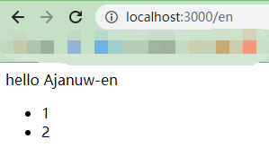

## Nestjs i18n Example

- [i18n docs](https://www.npmjs.com/package/i18n)

1) main.ts
```ts
import * as i18n from 'i18n';

app.use(i18n.init);

i18n.configure({
 defaultLocale: 'zh',
 directory: join(__dirname, '..', 'i18n'),
});
```

2) get value
```ts
import * as i18n from 'i18n';

i18n.setLocale('zh');
i18n.__('hello', "Ajanuw-zh") // 你好 Ajanuw-zh

i18n.setLocale('en');
i18n.__('hello', "Ajanuw-en") // hello Ajanuw-zh
```


